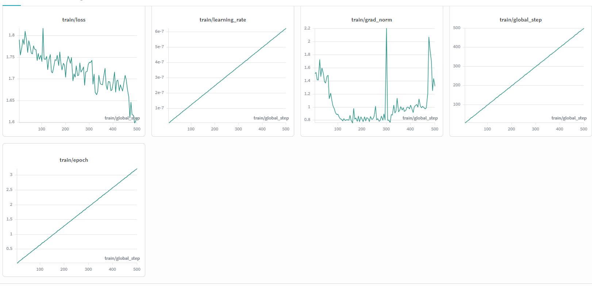

# Alpamayo 2 Super SFT

Fine-tune and evaluate the release-native Alpamayo 2 Super model on
PhysicalAI-Autonomous-Vehicles (PAI). The recipe loads the Hugging Face checkpoint directly; it
does not convert weights to an Alpamayo 1 checkpoint format.

## Table of Contents

- [Supported Workflow](#supported-workflow)
- [Requirements](#requirements)
- [Installation](#installation)
- [Model Access](#model-access)
- [Prepare PAI Chunks 0–99](#prepare-pai-chunks-099)
- [Verify the Data Split](#verify-the-data-split)
- [Stage-1 VLM Training](#stage-1-vlm-training)
- [Stage-2 Expert Training](#stage-2-expert-training)
- [Validation Loss](#validation-loss)
- [Trajectory Validation](#trajectory-validation)
- [Smoke Test](#smoke-test)
- [Outputs and Expected Signals](#outputs-and-expected-signals)
- [Known Limitations](#known-limitations)
- [Troubleshooting](#troubleshooting)

## Supported Workflow

The recipe uses:

- `alpamayo2_super.Alpamayo2Super` as the release model foundation;
- Hugging Face Trainer with DeepSpeed ZeRO-3;
- seven PAI cameras and four frames per camera;
- chunks 0–98 for training and held-out chunk 99 for validation;
- Stage 1 for VLM cross-entropy training;
- Stage 2 for the diffusion expert with a frozen VLM;
- validation loss and single-GPU expert-trajectory minADE evaluation.

The default checkpoint is:

```text
nvidia/Alpamayo2-Super
```

## Requirements

- Linux and Python 3.12.
- CUDA 12.x and H100 80 GB GPUs.
- Stage 1: 4 nodes × 8 H100 GPUs.
- Stage 2: 2 or more nodes × 8 H100 GPUs.
- One H100 80 GB for trajectory validation.
- Hugging Face access to the gated model and PAI dataset.
- Network access to the official
`[NVlabs/alpamayo2](https://github.com/NVlabs/alpamayo2)` inference repository during install.

## Installation

```bash
export WORKSPACE=/path/to/workspace

git clone https://github.com/NVlabs/alpamayo-recipes.git "$WORKSPACE/alpamayo-recipes"

cd "$WORKSPACE/alpamayo-recipes/recipes/alpamayo2_sft"
uv venv .venv
source .venv/bin/activate
uv sync --active
```

`uv sync` installs `alpamayo2_super` from the official inference repository declared in
`pyproject.toml`. As with the other SFT recipes, `uv.lock` pins the exact inference commit so the
model, tokenizer, expert, action-space, diffusion, and PAI-loader APIs remain reproducible. Shared
recipe utilities remain an editable dependency from `../../src`.

Authenticate before downloading gated artifacts. Set your Hugging Face token, then log in:

```bash
export HF_TOKEN=<your Hugging Face token>

hf auth login
hf auth whoami
```

## Model Access

The model ID is already set in `configs/model/release.yaml`. Override it with either another Hugging
Face model ID or a complete local snapshot:

```bash
export MODEL_ID=nvidia/Alpamayo2-Super

# Optional: download once for offline jobs.
huggingface-cli download "$MODEL_ID" --local-dir "$WORKSPACE/checkpoints/alpamayo2-super"
export MODEL_ID="$WORKSPACE/checkpoints/alpamayo2-super"
```

A local snapshot must include `config.json`, tokenizer and processor files, and all safetensors
shards.

## Prepare PAI Chunks 0–99

Download chunks 0 through 99, all seven cameras, egomotion, and calibration:

```bash
export PAI_DIR="$WORKSPACE/PhysicalAI-Autonomous-Vehicles"
cd "$WORKSPACE/alpamayo-recipes"

python scripts/download_pai.py \
  --chunk-ids 0-100 \
  --camera \
    camera_cross_left_120fov \
    camera_front_wide_120fov \
    camera_cross_right_120fov \
    camera_rear_left_70fov \
    camera_rear_tele_30fov \
    camera_rear_right_70fov \
    camera_front_tele_30fov \
  --calibration camera_intrinsics sensor_extrinsics \
  --labels egomotion \
  --output-dir "$PAI_DIR"
```

Chunk ranges are half-open. `0-100` downloads chunks 0–99. The training config then uses
`chunk_ids="0-99"` for chunks 0–98 and `chunk_ids="99-100"` for held-out chunk 99.

## Verify the Data Split

Run this before allocating GPUs:

```bash
cd "$WORKSPACE/alpamayo-recipes/recipes/alpamayo2_sft"

python - <<'PY'
import os
from alpamayo.data.pai_utils import PhysicalAIAVDatasetLocalInterface

root = os.environ["PAI_DIR"]
train = PhysicalAIAVDatasetLocalInterface(root, chunk_ids="0-99")
val = PhysicalAIAVDatasetLocalInterface(root, chunk_ids="99-100")
print("train clips:", len(train.get_all_clip_ids()))
print("val clips:", len(val.get_all_clip_ids()))
PY
```

For the published PAI index, the expected counts are 9,881 training clips and 100 validation
clips.

**Weights & Biases:** To log runs to W&B, uncomment the `wandb` default, and set `report_to: wandb` under
`trainer` in [configs/sft_base.yaml](configs/sft_base.yaml). Additionally, fill in `team` and `project` in
[configs/wandb/default.yaml](configs/wandb/default.yaml), and have your W&B API key available when training starts.

## Stage-1 VLM Training

Run the following command on every training node. Set `NODE_RANK` to `0`, `1`, `2`, or `3`, and
use the same reachable `MASTER_ADDR` on all nodes:

```bash
cd "$WORKSPACE/alpamayo-recipes/recipes/alpamayo2_sft"

torchrun \
  --nnodes=4 \
  --nproc_per_node=8 \
  --node_rank="$NODE_RANK" \
  --master_addr="$MASTER_ADDR" \
  --master_port="${MASTER_PORT:-29500}" \
  -m alpamayo2_sft.train_hf \
  --config-path pkg://alpamayo2_sft/configs \
  --config-name sft_stage1 \
  model.pretrained_model_name_or_path="$MODEL_ID" \
  data.train_dataset.local_dir="$PAI_DIR" \
  data.train_dataset.chunk_ids="0-99" \
  data.val_dataset.local_dir="$PAI_DIR" \
  data.val_dataset.chunk_ids="99-100" \
  paths.output_dir="$WORKSPACE/outputs/alpamayo2-super-stage1"
```

Stage 1 trains the VLM and freezes the expert. The vision encoder uses one tenth of the language
model learning rate.

Example log lines:

```text
{'loss': 0.5177, 'grad_norm': 0.37673160323410626, 'learning_rate': 4.0000000000000003e-07, 'epoch': 0.02}
{'loss': 0.4834, 'grad_norm': 0.6861296231427919, 'learning_rate': 9e-07, 'epoch': 0.03}
{'loss': 0.4865, 'grad_norm': 0.9438558596531959, 'learning_rate': 1.4000000000000001e-06, 'epoch': 0.05}
{'loss': 0.5297, 'grad_norm': 0.5330038248475037, 'learning_rate': 1.9e-06, 'epoch': 0.06}
{'loss': 0.4487, 'grad_norm': 0.8410849936499092, 'learning_rate': 2.4000000000000003e-06, 'epoch': 0.08}
{'loss': 0.4665, 'grad_norm': 1.0705537698829397, 'learning_rate': 2.9e-06, 'epoch': 0.1}
{'loss': 0.35, 'grad_norm': 0.683444162467132, 'learning_rate': 3.4000000000000005e-06, 'epoch': 0.11}
{'loss': 0.7025, 'grad_norm': 2.1830342002588328, 'learning_rate': 3.9e-06, 'epoch': 0.13}
```

## Stage-2 Expert Training

Use a Stage-1 Trainer checkpoint containing `model.safetensors` or a sharded
`model.safetensors.index.json`:

```bash
export STAGE1_CKPT="$WORKSPACE/outputs/alpamayo2-super-stage1/checkpoint-500"

torchrun \
  --nnodes=2 \
  --nproc_per_node=8 \
  --node_rank="$NODE_RANK" \
  --master_addr="$MASTER_ADDR" \
  --master_port="${MASTER_PORT:-29500}" \
  -m alpamayo2_sft.train_hf \
  --config-path pkg://alpamayo2_sft/configs \
  --config-name sft_stage2 \
  model.pretrained_model_name_or_path="$MODEL_ID" \
  model.stage1_vlm_checkpoint_path="$STAGE1_CKPT" \
  data.train_dataset.local_dir="$PAI_DIR" \
  data.train_dataset.chunk_ids="0-99" \
  data.val_dataset.local_dir="$PAI_DIR" \
  data.val_dataset.chunk_ids="99-100" \
  paths.output_dir="$WORKSPACE/outputs/alpamayo2-super-stage2"
```

Stage 2 freezes the VLM and trains only the diffusion expert.

## Validation Loss

Validation loss supports distributed ZeRO-3 evaluation:

```bash
export EVAL_CKPT="$STAGE1_CKPT"

torchrun --nproc_per_node=8 \
  -m alpamayo2_sft.evaluate_hf \
  --config-path pkg://alpamayo2_sft/configs \
  --config-name sft_eval_loss \
  evaluate.eval_ckpt="$EVAL_CKPT" \
  data.val_dataset.local_dir="$PAI_DIR" \
  data.val_dataset.chunk_ids="99-100"
```

The command prints `Evaluation loss: ...` and logs `eval_loss`.

## Trajectory Validation

Trajectory generation requires an expert-enabled checkpoint and one process:

```bash
export EXPERT_CKPT="$WORKSPACE/outputs/alpamayo2-super-stage2/checkpoint-500"

CUDA_VISIBLE_DEVICES=0 python -m alpamayo2_sft.evaluate_hf \
  --config-path pkg://alpamayo2_sft/configs \
  --config-name sft_eval_trajectory \
  evaluate.eval_ckpt="$EXPERT_CKPT" \
  evaluate.max_eval_steps=100 \
  data.val_dataset.local_dir="$PAI_DIR" \
  data.val_dataset.chunk_ids="99-100"
```

The command prints `Evaluation minADE: ... m` and logs `eval_min_ade`.
It samples six trajectories in memory-bounded groups of two, then computes the minimum ADE over
all six. This fits on one H100 80 GB while preserving the standard minADE sampling protocol.

Run zero-shot trajectory evaluation of the release checkpoint on all 100 clips in held-out chunk
99 with:

```bash
CUDA_VISIBLE_DEVICES=0 python -m alpamayo2_sft.evaluate_hf \
  --config-path pkg://alpamayo2_sft/configs \
  --config-name sft_eval_trajectory \
  evaluate.eval_ckpt="$MODEL_ID" \
  evaluate.max_eval_steps=100 \
  data.val_dataset.local_dir="$PAI_DIR" \
  data.val_dataset.chunk_ids="99-100"
```

For the pinned release checkpoint and PAI snapshot, the example zero-shot result is
`eval_min_ade=0.8288` m.

## Smoke Test

The debug config runs two Stage-1 steps on PAI chunk 0 with one camera and optimizer offload. It
still needs all eight GPUs on one H100 node:

```bash
torchrun --nproc_per_node=8 \
  -m alpamayo2_sft.train_hf \
  --config-path pkg://alpamayo2_sft/configs \
  --config-name sft_stage1_single_node_debug \
  model.pretrained_model_name_or_path="$MODEL_ID" \
  data.train_dataset.local_dir="$PAI_DIR" \
  data.val_dataset.local_dir="$PAI_DIR"
```

Run the equivalent two-step expert SFT smoke:

```bash
torchrun --nproc_per_node=8 \
  -m alpamayo2_sft.train_hf \
  --config-path pkg://alpamayo2_sft/configs \
  --config-name sft_stage2_single_node_debug \
  model.pretrained_model_name_or_path="$MODEL_ID" \
  data.train_dataset.local_dir="$PAI_DIR" \
  data.val_dataset.local_dir="$PAI_DIR"
```

For a short validation smoke:

```bash
CUDA_VISIBLE_DEVICES=0 python -m alpamayo2_sft.evaluate_hf \
  --config-path pkg://alpamayo2_sft/configs \
  --config-name sft_eval_trajectory \
  evaluate.eval_ckpt="$MODEL_ID" \
  evaluate.max_eval_steps=2 \
  data.val_dataset.local_dir="$PAI_DIR"
```

## Outputs and Expected Signals

- `outputs/.../config.yaml`: fully resolved run configuration.
- `outputs/.../checkpoint-N/`: Hugging Face Trainer checkpoints.
- Stage-1 logs: finite total loss, `future_traj_ce`, and `others_ce`.
- Loss validation: finite `eval_loss`.
- Trajectory validation: finite `eval_min_ade` in meters.
- PAI split: 9,881 training clips and 100 held-out validation clips.

The recipe was smoke-tested on 8 H100 80 GB GPUs with the release-native Alpamayo 2 Super
checkpoint:

- two Stage-1 steps: loss `1.8095` then `1.7255`;
- two Stage-2 steps: loss `1.2710` then `0.9367`;
- full held-out chunk-99 validation: `eval_loss=1.699801`;
- all 100 held-out chunk-99 clips with six samples: `eval_min_ade=0.8288` m.

A 500-step Stage-1 VLM run on public PAI (8 nodes × 8 H100s, gradient accumulation 1) shows
decreasing `train/loss` from about 1.8, linear warmup of `train/learning_rate`, and finite
`train/grad_norm`:



These values are diagnostics for the pinned checkpoint and data snapshot, not general acceptance
thresholds.

## Known Limitations

- The recipe covers trajectory SFT on public PAI chunks. It does not reproduce NVIDIA's internal
mixed training dataset.
- PAI chunk ranges use an exclusive upper bound.
- The provided PAI subset has no reasoning parquet, so CoC/meta-action SFT is not enabled.
- Trajectory generation is single-process because Hugging Face `generate()` is incompatible with
ZeRO-3-partitioned embeddings.
- Full 32B training and trajectory evaluation are GPU workflows; CPU tests cover configuration,
data contracts, optimizer grouping, and metric math only.

## Troubleshooting

- `401`, `403`, or gated-repository errors: run `hf auth login` and accept both model and dataset
licenses.
- Missing chunk files: download with `--chunk-ids 0-100`; `0-99` omits validation chunk 99.
- `ModuleNotFoundError: alpamayo2_super`: rerun `uv sync --active` with network access to
`https://github.com/NVlabs/alpamayo2`.
- CUDA OOM during Stage 1: confirm 32 GPUs and ZeRO-3 are active. Use the debug config only for a
short single-node smoke.
- Trajectory evaluation rejects multiple processes: launch it with
`CUDA_VISIBLE_DEVICES=0 python`, not `torchrun`.
